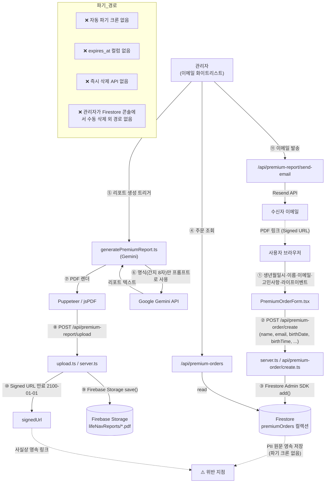

# 개인정보 처리 흐름 감사 — 2026-07-03 (Phase 0)

> IMPLEMENTATION_PLAN.md §16 절대 원칙 2 (**개인정보 최소화**) 대비 현행 흐름의 격차를 진단한다.

---

## 1. 결론 — 원칙 위반

현행 시스템은 **PII를 저장·보관**한다. Phase 2 데이터 계층 재설계에서 다음 3가지를 반드시 시정한다.
1. Firestore `premiumOrders`에 이름·이메일·생년월일시가 원문 저장됨.
2. 리포트 PDF가 Firebase Storage에 `2100-01-01` 만료 Signed URL로 업로드 — 사실상 영속.
3. 자동 파기 크론·`expires_at` 컬럼·즉시 삭제 API 부재.

---

## 2. 데이터 흐름 다이어그램



---

## 3. 저장 위치별 실측

### 3-1. Firestore `premiumOrders`
저장 필드 (`server.ts:495`, `premiumOrderStore.ts:83`):

| 필드 | 유형 | PII 판정 |
|---|---|---|
| `name` | string | **🔴 PII (성명)** |
| `email` | string | **🔴 PII (연락처)** |
| `birthDate` | string (YYYY-MM-DD) | **🔴 PII (준식별자)** |
| `birthTime` | string (HH:mm) | **🔴 PII (준식별자)** |
| `gender` | 'M'/'F' | 🟡 민감정보 아님, 사주 산출용 |
| `isLunar`, `isLeap`, `unknownTime` | bool | 산출 파라미터 |
| `tier`, `price` | string, number | 주문 메타 |
| `concern`, `interest` | string (자유 입력) | **🔴 PII 위험** (자유 서술에 신원 노출 가능) |
| `lifeEvents` | Array<{year, description}> | **🔴 PII 위험** (자유 서술) |
| `reportText` | string | 생성된 리포트 본문 (PII 결합체) |
| `pdfUrl` | string | 영속 Signed URL |
| `status`, `version`, `createdAt`, `generatedAt`, `sentAt`, `updatedByCustomerAt` | 상태/타임스탬프 |

**Firestore 보안 규칙** (`firestore.rules:180`):
```
match /premiumOrders/{orderId} {
  allow read, write: if isAdmin();          // 관리자 이메일 화이트리스트
  allow get: if true;                        // ⚠️ 누구나 orderId만 알면 조회 가능
  allow list: if false;
  allow create: if true;                     // ⚠️ 무제한 생성 허용
  allow update: if ...                        // 고객이 email 일치 시 일부 필드 수정
}
```
- `allow get: if true`, `allow create: if true` — 레이트리밋 없음. Phase 3 보안 점검의 최우선 대상.
- 관리자 판정: `token.email == "dean.uitrading@gmail.com" || "dean.sj.oh@gmail.com"` 하드코딩.

### 3-2. Firebase Storage `lifeNavReports/*.pdf`
- 업로드 경로: `server.ts:190` / `api/premium-report/upload.ts` / `api/premium-report/upload-url.ts`.
- 파일명: `{Date.now()}_{safeName}.pdf` — 유추 가능성 있음(타임스탬프 기반).
- Signed URL 만료: **`2100-01-01`** (`server.ts:239`, `api/premium-report/upload.ts:138`, `api/generate-pdf.ts:152,172`, `api/premium-report/upload-url.ts:74`) — 사실상 영속.
- 로컬 폴백: `.tmp/premium-reports/` (dev 환경).

### 3-3. 이메일 (Resend)
- `server.ts:262` — Resend API 호출로 리포트 링크 발송.
- 이메일 본문에 이름·리포트 링크(Signed URL) 포함.
- Resend 서비스에는 발송 이력이 남음 — **외부 3rd party 데이터 잔존**. Phase 2에서 명시적 언급 필요.

### 3-4. 브라우저 로컬
- `localStorage` — 모델 쿨다운 상태(`modelCooldown.ts`)만 저장. PII 없음.
- 채팅 이력 — React state에만 존재, 새로고침 시 소실.

### 3-5. 서버 로그
- `console.log('Creating premium order via Admin SDK:', { name: order.name, email: order.email })` (`server.ts:481`).
- 프로덕션 로그에 이름·이메일이 원문 기록됨. **Vercel/서버 로그 잔존 이슈**.

---

## 4. 입력 → 처리 → 저장 → 파기 경로 요약

| 단계 | 위치 | PII 처리 |
|---|---|---|
| 입력 | `PremiumOrderForm.tsx` | 이름·이메일·생년월일시·자유 서술 입력받음 |
| 검증 | `server.ts:484` | 필수 필드 존재 확인만. 형식 검증 없음 |
| 저장 (주문) | Firestore `premiumOrders` | **원문 저장** |
| 처리 | `generatePremiumReport.ts` | Gemini에 명식(간지 8자)만 전달. 이름은 프롬프트에 포함(`userName`). |
| 저장 (리포트) | Firestore `reportText` + Storage PDF | 리포트 본문+PDF 영속 |
| 발송 | Resend | 이메일에 이름·PDF 링크 포함 |
| **파기** | **없음** | ❌ 크론·API·수동 절차 모두 부재 |

---

## 5. IMPLEMENTATION_PLAN.md 원칙 대비 격차

### §16 원칙 2 요구 사항
> DB에 이름·전화번호·이메일·주소 컬럼을 **절대 만들지 않는다**. 저장 가능한 것은 사주 코드, 명식(간지 8자), 생성일, 주문 상태뿐.

### 현행 격차
| 요구 사항 | 현행 | 격차 |
|---|---|---|
| 이름 컬럼 금지 | `name: String(order.name)` | 🔴 위반 |
| 이메일 컬럼 금지 | `email: String(order.email)` | 🔴 위반 |
| 생년월일시 컬럼 금지 (사주 코드로 대체) | `birthDate`, `birthTime` 원문 저장 | 🔴 위반. **명식 8자 + 대운수만 저장하도록 재설계 필요** |
| 사주 코드 발급 | 없음 | 🔴 미구현 |
| 저장 컬럼 4종으로 축소 (code, myeongsik, created_at, deleted_at) | 자유 서술·자유 입력 다수 저장 | 🔴 위반 |
| `reports.expires_at` 72시간 자동 파기 | 없음. Signed URL 만료 `2100-01-01` | 🔴 위반 |
| `DELETE /api/purge?code=` 즉시 삭제 API | 없음 | 🔴 미구현 |
| 공유 카드에 생시 미노출 | 공유 카드 자체 미구현 | ⚪ Phase 2 신규 |

---

## 6. Phase 2 재설계 최소 요건 (Phase 0 관찰 기반 제안)

1. **`premiumOrders` 폐기 → `codes`+`orders`+`reports` 3분리**.
   - `codes`: `code`, `myeongsik(8자 + 대운수)`, `created_at`, `deleted_at`.
   - `orders`: `order_no`, `code_id`, `product`, `status`, `amount`, `created_at`.
   - `reports`: `report_id`, `code_id`, `body(blob)`, `expires_at (created_at + 72h)`.
2. **이메일·이름은 Resend 발송 직후 폐기** — DB 저장 금지. 발송 실패 시 재발송용 임시 큐만 최대 24시간 보유.
3. **자동 파기 크론**(Vercel Cron) — 매시간 `reports.expires_at < now()` 삭제.
4. **`DELETE /api/purge?code=`** — 코드 소유자 인증(코드+생년만 알면 삭제 가능) 후 즉시 파기.
5. **서명 URL 만료 72시간**으로 단축.
6. **서버 로그에서 이름·이메일 제거**. 사주 코드만 로깅.

---

## 7. 즉시 대응 가능한 항목 (Phase 1 진입 전 별도 스프린트)

Phase 2까지 대기하기 곤란한 리스크는 다음과 같다. `docs/decisions.md`에 OWNER 결정 요청 항목으로 등재.

| 우선순위 | 항목 | 근거 |
|---|---|---|
| 🚨 P0 | Firestore `premiumOrders` 신규 생성 즉시 중단 옵션 검토 (베타 유입 최소화) | 신규 주문마다 PII가 계속 축적됨 |
| 🚨 P0 | Signed URL 만료 `2100-01-01` → 30일 등으로 단축 | 하드코딩 5곳 수정만으로 리스크 축소 |
| 🟡 P1 | 서버 로그에서 이름·이메일 마스킹 | `server.ts:481` 등 |
| 🟡 P1 | `allow create: if true`에 레이트리밋 룰 추가 | Firestore 규칙 |

위 4건은 Phase 2를 기다리지 않고 별도 커밋으로 처리 가능하지만, 개인정보 처리방침·베타 운영 정책과 결합되어 있어 OWNER 승인 후 진행한다.
